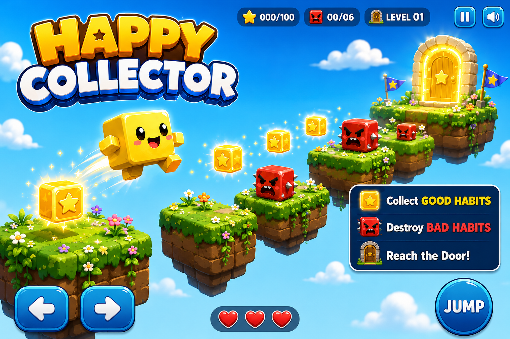

# Happy Collector: 20-Level Three.js Browser Platformer

  

  <a href="README.md">English</a> ·
  <a href="README.ar.md">العربية</a> ·
  <a href="README.fr.md">Français</a> ·
  <a href="README.zh-CN.md">简体中文</a>

**Play:** https://kids-happy-collector.vercel.app/  
**Itch.io:** https://joenasr.itch.io/happy-collector

Happy Collector is a 20-level Three.js browser platformer developed as one module in a multi-game interactive children's edutainment activation in the UAE.

You control a smiling yellow cube along floating platform routes. Yellow blocks carry positive emotions and qualities; red moving enemies carry negative emotions and behaviors. Collect yellow blocks for points, avoid or stomp red enemies, navigate platform obstacles, and reach the level door to advance.

## How it plays

**move and jump → collect positive blocks → avoid or stomp red enemies → navigate obstacles → reach the door → advance**

- Yellow collectible: **+10 points**
- Stomp a red enemy from above while descending: **+5 points**
- Contact with a red enemy or falling from the route costs one life
- You start a run with **3 lives**
- After losing a life, the current level restarts while the remaining lives persist
- Collecting every yellow block is **not required** to finish a level
- Reaching the door advances to the next level
- Completing Level 20 ends the run with **MASTER COLLECTOR!**

Yellow blocks use the labels **BRAVERY, JOY, LOVE, HOPE, PEACE, KINDNESS, CALM, PRIDE, TRUST, HAPPINESS**. Red-enemy labels are **ANGER, GREED, JEALOUSY, RUDENESS, ENVY, HATE, DESPAIR**.

## Controls

**Desktop**
- `A / D` or `Left / Right Arrow` : move
- `W`, `Space`, or `Up Arrow` : jump
- Mouse wheel : zoom after gameplay movement begins

**Mobile**
- On-screen left/right controls : move
- On-screen jump control : jump
- Two-finger pinch : zoom after gameplay movement begins

## Gameplay systems

The game includes horizontal and vertical moving platforms, pendulum platforms, curved and rope-bridge sequences, button-controlled gates, button-raised steps, cracking glass platforms, stompable patrolling enemies, changing skies, ambient scenery, level-introduction cinematics, door-arrival transitions, six looping music tracks, synthesized gameplay SFX, cinematic wind audio, visual feedback and supported-device vibration.

Glass platforms crack when stood on, remain solid while occupied, then fall and fade after the player leaves. Legacy pop-up/falling path-platform behavior is disabled.

## Level architecture

The game builds all 20 levels from reusable platform and obstacle definitions. Levels 11 to 20 use these named layouts:

11. Glass Garden Switchback  
12. Cracking Orchard Bridge  
13. Button Garden Run  
14. Pendulum Picnic Crossing  
15. Raised Stair Workshop  
16. Bad Habit Patrol Park  
17. Cloud Lift Labyrinth  
18. Glass Habit Trial  
19. Switchback Sky Garden  
20. Good Habit Summit

## Implementation

- `index.html` : complete playable game and runtime logic
- `libs/three.r128.min.js` : local Three.js r128 runtime
- `libs/THREE_LICENSE.txt` : bundled Three.js license
- `music/` : six local music tracks
- `sfx/` : local cinematic wind audio
- `fonts/` : local fonts
- `docs/` : level-expansion rules and pre-delivery QA documentation

Three.js loads from the local `libs/` folder. Most gameplay sound effects are generated with the Web Audio API.

## Event activation

Happy Collector was developed as one module in a multi-game interactive children's edutainment activation in the UAE.

Event production: [Peach Society](https://peach-society.com/), Dubai.

## Licensing

The repository currently does **not** declare a project-wide license. The bundled Three.js license applies to Three.js; it should not be interpreted as automatically licensing the Happy Collector game code, artwork, audio, fonts, or other project assets.
